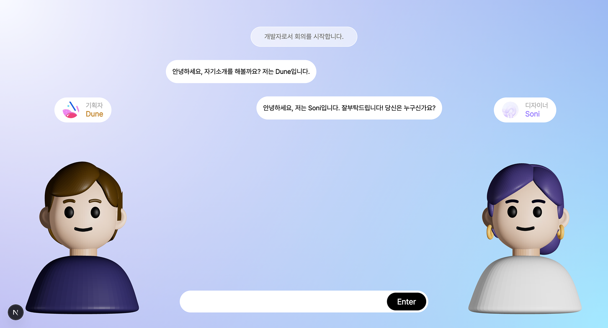

# 01. 프로젝트 개요

> [← 문서 인덱스](../README.md)

---

## 1. 무엇을 만들었나

TeamTalk은 **역할이 서로 다른 AI 에이전트 두 명과 동시에 대화하는 서비스**입니다.

일반적인 챗봇은 사용자와 모델이 1:1로 주고받습니다. TeamTalk은 여기서 두 가지를 바꿨습니다.

1. **응답자가 여러 명이다.** 개발자·디자이너·기획자 세 역할 중 사용자가 두 명을 고르면, 하나의 질문에 대해 서로 다른 관점의 답이 나옵니다.
2. **응답자끼리 서로를 본다.** 두 번째로 답하는 에이전트는 사용자 입력만이 아니라 **먼저 답한 에이전트의 출력도 함께 입력으로 받습니다.** 그래서 단순히 답이 두 개 나오는 게 아니라, 동의하거나 반박하는 토론에 가까운 형태가 됩니다.

여기에 3D 아바타와 TTS 립싱크를 얹어, 텍스트 로그가 아니라 **회의실에 두 동료가 앉아있는 것처럼** 보이게 만들었습니다.

<p align="center">
  
  <br/><sub>ConversationRoom. 좌측 기획자 Dune, 우측 디자이너 Soni. 사용자는 개발자 역할로 참여 중.</sub>
</p>

---

## 2. 기획 배경 — 두 번의 문제 정의

TeamTalk의 문제 정의는 프로젝트 진행 중 한 번 크게 바뀌었습니다. 두 정의 모두 코드에 흔적이 남아 있습니다.

### 2-1. 초기 정의 (v1) — 다관점 아이디어 확장

> "하나의 아이디어가 여러 시선 속에서 울림을 만들도록, AI 아바타들과 함께 질문을 나누고, 다양한 관점으로 생각을 확장하는 **대화형 아이디어 실험실**"
> — `src/app/page.tsx` 랜딩 카피

출발점은 **기술적 관심**이었습니다. 기획 당시(2025년 초)에는 MCP 정도가 화제였고, 에이전트·모델 간 오케스트레이션 개념은 아직 널리 알려지지 않은 시점이었습니다. 다음에 올 패러다임이라 보고 선행해서 직접 만들어보자는 동기가 컸습니다.

여기에 비용 관점의 가설이 붙었습니다. **범용 대형 모델은 호출 비용이 크고 단일 관점에 치우치기 쉽다. 역할별 소형 모델을 협업시키면 저비용으로 다각적 관점을 줄 수 있지 않을까?**

이 단계의 에이전트는 *직업*이 아니라 *사고 성향*으로 구분되었습니다. 지금도 `src/app/slideData.tsx`에 그대로 남아 있습니다.

| 에이전트 | 표기된 모델 | 성향 | 3D 모델 |
| --- | --- | --- | --- |
| 분석적인 상균 | Chat-GPT | 사실적 기반 분석 | `sanggyun.glb` |
| 철학적인 동년 | Claude | 철학적 기반 분석 | `dongnyeon.glb` |
| 감성적인 채영 | Gemini | 감정 기반 분석 | `chaeyoung.glb` |
| 실무적인 정민 | Copilot | 실무적 기반 분석 | `jungmin.glb` |

> 아바타 이름과 3D 모델은 **팀원 4명의 이름과 얼굴**에서 따왔습니다. 컴포넌트 파일명이 `Avatar_GPT` / `Avatar_Claude` / `Avatar_Gemini` / `Avatar_Llama`인 것도 이 시기의 흔적입니다. 최종 버전에서 이 이름들은 실제 상용 모델과 무관합니다.

초기 UI/UX 시안도 이 정의를 반영합니다. 성향이 다른 두 AI를 좌우에서 고르고("PICK YOUR CLIENT"), 던진 질문에 각자 답하는 구조입니다.

<p align="center">
  
  <br/><sub>초기 시안. 에이전트 선택 화면과 대화 화면. 다크 테마 · 터미널 감성 · 성향 기반 페르소나.</sub>
</p>

### 2-2. 최종 정의 (v2) — 직군 간 커뮤니케이션 훈련

문제는 "그래서 이걸 누가 왜 쓰는가"였습니다. *사고 성향이 다른 AI에게 질문한다*는 것만으로는 사용자가 앱을 다시 열 이유가 약했습니다.

그래서 **문제를 사람 쪽으로 옮겼습니다.**

> 실무에서 협업이 깨지는 지점은 대부분 기술이 아니라 **직군 간 언어 차이**다. 개발자는 공수와 기술 부채로 말하고, 디자이너는 사용자 경험으로 말하고, 기획자는 비즈니스 임팩트로 말한다. 신입·주니어는 이 번역을 연습할 기회가 없다.

TeamTalk의 최종 정의는 여기서 나왔습니다.

> **다른 직군의 동료와 협업하는 법을, 실제 회의 상황을 시뮬레이션하며 안전하게 연습하는 서비스**

이 전환으로 세 가지가 바뀌었습니다.

| | 초기 (v1) | 최종 (v2) |
| --- | --- | --- |
| 에이전트 정체성 | 사고 성향 (분석적/철학적/감성적/실무적) | **직군** (개발자/디자이너/기획자) |
| 사용자의 위치 | 질문자 — 바깥에서 관찰 | **참여자** — 본인도 직군을 골라 회의에 참여 |
| 대화의 목적 | 아이디어 확장 | **상황별 목표 달성** (시나리오 기반) |
| 온보딩 | 에이전트 고르기 | **내 직군 선택 → 상황 선택 → 나머지 두 직군이 동료로 배정** |

핵심 설계 변화는 마지막 줄입니다. 최종 버전에서 **사용자는 동료를 직접 고르지 않습니다.** 본인이 직군을 고르면 나머지 두 직군이 자동으로 배정됩니다 (`src/app/OnboardingSecondPage/page.tsx`).

```ts
// 사용자 역할과 User를 제외한 나머지 2개가 자동으로 동료가 된다
const otherRoles = Object.values(Role).filter(
  (role) => role !== Role.User && role !== roleParam
);
const agentA = otherRoles[0];
const agentB = otherRoles[1];
```

"내가 개발자면 반드시 디자이너·기획자와 대화하게 된다"는 제약이야말로 **커뮤니케이션 훈련**이라는 목적에 맞습니다. 편한 상대만 고르는 걸 막기 때문입니다.

> v1의 에이전트 선택 화면(`src/app/ChooseAgent/`)은 삭제되지 않고 코드에 남아 있으나, **현재 어떤 경로에서도 도달할 수 없습니다.** 자세한 내용은 [08. 알려진 이슈](08-known-issues.md#4-chooseagent-페이지-고립)를 참고하십시오.

---

## 3. 타깃 사용자

- 협업 경험이 적은 **학생·취업준비생·신입/주니어 실무자**
- 특히 **팀 프로젝트나 해커톤에서 처음 만난 타 직군과 일해야 하는 상황**에 놓인 사람

시나리오 난이도가 초급/중급/고급으로 나뉘어 있는 것도 이 타깃을 반영합니다.

---

## 4. 시나리오

`src/data/senario.json`에 정의된 3종입니다. 사용자는 온보딩 2단계에서 하나를 고르며, 선택 결과는 Supabase `sessions.scenario_type`과 `sessions.session_description`에 저장됩니다.

### 시나리오 1 — 해커톤 팀 빌딩 (초급자용)

> 해커톤 첫날, 처음 만난 팀원들과 첫 미팅

- **목표**: 처음 만난 팀원들과 자연스럽게 자기소개하고 역할을 분담하기
- **학습 포인트**
  - 🙋 자기소개로 강점 어필하기
  - 🤝 팀원의 직무와 스타일 이해하기
  - 📅 함께 현실적인 목표와 일정 세우기

### 시나리오 2 — 기능 기획 회의 (중급자용)

> 새로운 서비스 기능에 대한 기획 논의

- **목표**: 아이디어를 각 직군이 이해할 수 있게 설명하기
- **학습 포인트**
  - ⚖️ 기술과 비즈니스 요구 조율
  - 🎨 UX와 개발 난이도 타협
  - 📊 데이터로 설득·우선순위 결정

### 시나리오 3 — 갈등 해결 (고급자용)

> 디자인과 개발 일정 간 충돌 발생

- **목표**: 충돌을 협력으로 바꾸기
- **학습 포인트**
  - 🤝 입장과 제약 이해하기
  - 🗣️ 감정보다 논리로 토론하기
  - 🛠️ 모두가 수용할 대안 찾기

난이도 설계가 명확합니다. **초급은 관계 형성 → 중급은 이해관계 조율 → 고급은 갈등 중재**로, 커뮤니케이션 난도가 단계적으로 올라갑니다.

---

## 5. 페르소나 (직군 에이전트)

`src/app/config/RoleConfig.ts`에 정의된 3직군입니다. 각 직군은 이름·성격·관심사·테마 컬러·3D 모델·TTS 음성을 하나의 설정 객체로 묶어 관리합니다.

| | 🧑‍💻 개발자 | 📋 기획자 | 🎨 디자이너 |
| --- | --- | --- | --- |
| **이름** | **Devu** | **Dune** | **Soni** |
| **성격** | 꼼꼼하고 현실적, 가끔 직설적 | 논리적이지만 친근하고, 질문을 많이 함 | 창의적이고 사용자 중심적, 감성적 접근 |
| **관심사** | 코드 품질, 성능 최적화, 기술 부채 | 비즈니스 임팩트, 사용자 니즈, ROI | 사용자 경험, 접근성, 브랜드 일관성 |
| **테마 컬러** | `#747474` | `#C58B3A` | `#997EFF` |
| **3D 모델** | `sanggyun.glb` | `dongnyeon.glb` | `jungmin.glb` |
| **TTS 음성** | `ko-KR-Chirp3-HD-Achird` | `ko-KR-Wavenet-D` | `ko-KR-Wavenet-B` |

**성격과 관심사가 곧 프롬프트 설계의 근거**입니다. 개발자가 "그거 2주 걸립니다"라고 말하고 기획자가 "그래서 사용자한테 어떤 가치가 있죠?"라고 되묻는 것이 자연스럽도록, 각 역할의 관심사를 명시적으로 정의했습니다.

> `Role` enum에는 위 3직군 외에 `Role.User`가 있습니다. 이는 사용자 본인을 가리키며, 에이전트 선택 목록에서는 항상 필터링됩니다.

---

## 6. 화면 흐름

```
  ┌──────────────────┐
  │  /  (랜딩)        │  CircularText · SplitText 애니메이션
  └────────┬─────────┘  "ENTER" 클릭
           ↓
  ┌──────────────────┐
  │  /login          │  Supabase Auth · 로그인 / 회원가입 토글
  └────────┬─────────┘
           ↓
  ┌──────────────────────────┐
  │  /OnboardingFirstPage    │  "당신은 직군을 선택하세요"
  │                          │  → localStorage: selectedRole
  └────────┬─────────────────┘  → 쿼리스트링: ?role=developer
           ↓
  ┌──────────────────────────┐
  │  /OnboardingSecondPage   │  ① 시나리오 3종 중 선택
  │                          │  ② 배정된 동료 2명 미리보기 (3D)
  │                          │  → Supabase sessions INSERT
  │                          │  → localStorage: chatSession, session_id
  └────────┬─────────────────┘  → 쿼리스트링: ?agentA=planner&agentB=designer
           ↓
  ┌──────────────────────────┐
  │  /ConversationRoom       │  3D 아바타 2명 + 채팅 + TTS 립싱크
  └──────────────────────────┘
```

> `/ChooseAgent`는 이 흐름에 포함되지 않습니다. v1의 잔존 화면입니다.

각 화면의 구현 상세는 [03. 프론트엔드](03-frontend.md)를 참고하십시오.

---

## 7. 대화 한 턴의 동작

사용자가 메시지를 보내고 답이 재생되기까지의 흐름을 요약하면 다음과 같습니다.

```
사용자 입력 + 역할 에이전트 2개 (온보딩에서 확정)
        ↓ POST webhook (session_id, sender_role, content, worker1_role, worker2_role)
n8n 오케스트레이터 에이전트
        ↓ "누가 / 언제 / 답할지 말지" 판단
Ollama 역할 에이전트 (개발자·디자이너·기획자 중 선택된 2개)
        ↓ 순차 생성 — 둘 다 답할 수도, 한쪽만 답할 수도 있음
n8n → Supabase(PostgreSQL) 저장
        ↓ Respond to Webhook
프론트엔드
        ↓ 메시지를 큐에 담아 한 개씩 재생
FastAPI TTS (Google TTS) → faster-whisper 타이밍 추출
        ↓ mp3 + 타이밍 JSON
3D 아바타 립싱크 + 음성 재생 → 재생 완료 시 다음 메시지로
```

핵심은 **오케스트레이터가 턴을 판단한다**는 점과, **선택된 각 에이전트는 한 턴에 최소 0회, 최대 1회만 발화한다**는 제약입니다. 이 제약이 대화가 무한히 도는 것을 구조적으로 막습니다. 자세한 내용은 [05. n8n 워크플로](05-n8n-workflow.md)를 참고하십시오.

---

## 8. 프로젝트 결과

- 🏆 **최우수상** 수상
- **논문 1편** — 설계·아키텍처·결과·구현 가능성을 중심으로 정리, 팀장 김상균이 기획·아키텍처·결과 정리를 담당하고 공저자로 등재

높게 평가된 지점은 **최신 기술의 방향성을 선행 제시했다**는 점이었습니다. 단일 LLM 호출이 일반적이던 시점에, 에이전트 간 협업과 오케스트레이션이라는 다음 단계 구조를 학부 수준의 자원 제약 안에서 실제로 동작하는 형태까지 구현했습니다.

동시에 이 프로젝트는 명확한 한계도 함께 남겼습니다. LoRA 파인튜닝의 효과가 미미했고(개선폭 1% 미만), 단일 홈서버의 리소스 한계로 응답 지연이 컸습니다. 이 한계들은 숨기지 않고 [08. 알려진 이슈](08-known-issues.md)에 정리했습니다.

---

| ← | → |
| --- | --- |
| [문서 인덱스](../README.md) | [02. 시스템 아키텍처](02-architecture.md) |
