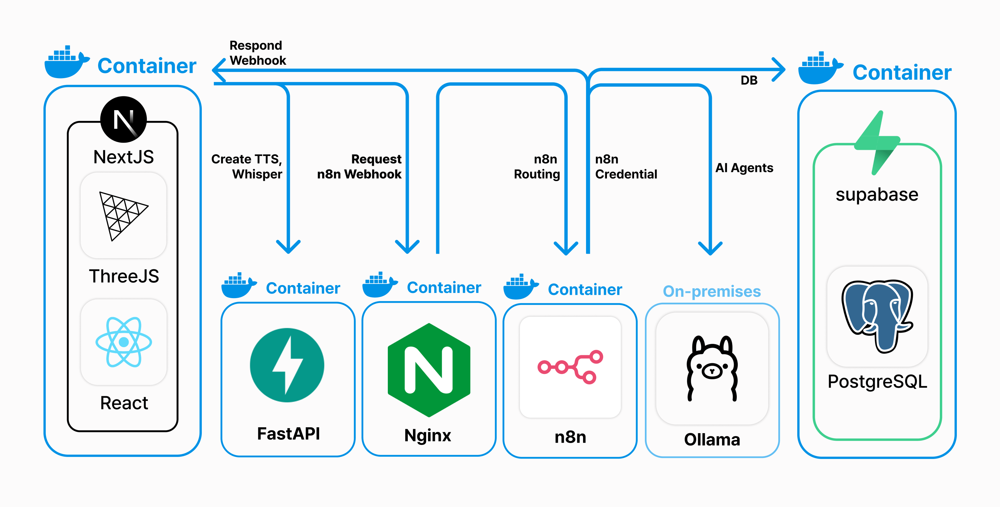

# 02. 시스템 아키텍처

> [← 01. 프로젝트 개요](01-overview.md) · [문서 인덱스](../README.md)

---

## 1. 전체 구성

<p align="center">
  
</p>

TeamTalk은 **6개 구성요소**로 이루어집니다. Ollama를 제외한 전부가 Docker 컨테이너이며, 전체가 **단일 Mac mini M4 홈서버** 위에서 동작했습니다.

| 구성요소 | 역할 | 배포 형태 |
| --- | --- | --- |
| **Next.js** (React / Three.js) | 웹 클라이언트. 온보딩, 3D 아바타 렌더링, 대화 UI, 립싱크 재생 | Docker |
| **n8n** | 멀티에이전트 오케스트레이션. 웹훅 수신, 턴 판단, 에이전트 라우팅, DB 저장 | Docker |
| **Ollama** | LLM 추론. 역할별 LoRA 모델 서빙 | **On-premise** (컨테이너 아님) |
| **Supabase** | 인증 + PostgreSQL. 사용자·세션·대화 저장 | Docker |
| **FastAPI** | TTS 생성 + Whisper 기반 립싱크 타이밍 추출 | Docker |
| **Nginx** | 리버스 프록시. 443/80 종단, TLS 종료, FE/BE 라우팅 | Docker |

### 왜 Ollama만 컨테이너가 아닌가

Ollama는 macOS에서 **Metal(Apple Silicon GPU) 가속**을 쓰기 위해 호스트에 직접 설치했습니다. Docker Desktop for Mac은 컨테이너에서 GPU에 접근할 수 없기 때문에, 컨테이너화하면 CPU 추론으로 떨어져 7~8B 모델의 응답 속도를 감당할 수 없습니다. 16GB 단일 머신에서 멀티에이전트를 돌리는 상황에서 이 차이는 결정적이었습니다.

---

## 2. 요청 흐름

### 2-1. 대화 한 턴 (핵심 경로)

```
[브라우저]
    │
    │  ① POST {NEXT_PUBLIC_API_URL}/webhook/expert-models
    │     body: { session_id, sender_role, is_user, content,
    │             worker1_role, worker2_role }
    │     ※ 브라우저에서 n8n을 직접 호출 (cross-origin)
    ↓
[n8n]
    │  ② Check if OPTIONS — preflight면 즉시 응답하고 종료
    │  ③ 사용자 발화를 conversations 테이블에 저장
    │  ④ 오케스트레이터 에이전트 (OpenAI + Structured Output Parser)
    │     → "누가 / 언제 / 답할지 말지" 판단
    │  ⑤ Switch — 판단 결과에 따라 planner / designer / developer 분기
    ↓
[Ollama]  ⑥ 해당 역할 모델이 응답 생성
    ↓
[n8n]
    │  ⑦ 에이전트 응답을 conversations 테이블에 저장
    │  ⑧ 2라운드 — 다른 에이전트가 직전 출력을 보고 응답 (필요 시)
    │  ⑨ 전체 응답을 모아 포맷팅
    │  ⑩ Respond to Webhook
    ↓
[브라우저]
    │  ⑪ messages[] 를 재생 큐에 적재, currentIndex = 0
    │
    │  ⑫ 각 메시지마다:
    │     POST {TTS}/tts/speak  { text, voice }
    ↓
[FastAPI]
    │  ⑬ Google Cloud TTS 호출 → mp3 저장
    │  ⑭ faster-whisper로 mp3 재분석 → 구간별 타이밍 JSON 저장
    │     → { filename, json } 반환
    ↓
[브라우저]
    │  ⑮ GET /tts/json/{json}     → 타이밍 데이터
    │     GET /public/tts/{mp3}   → 음성 파일
    │  ⑯ 한글 자모 분해 → viseme 매핑 → morph target 애니메이션
    │  ⑰ 음성 재생 완료(onended) → currentIndex + 1 → ⑫ 반복
```

**설계상 중요한 지점 두 가지**

1. **TTS는 n8n 흐름 밖에 있습니다.** n8n은 텍스트만 반환하고, 음성 생성은 프론트엔드가 메시지를 재생할 때마다 개별적으로 요청합니다. 덕분에 n8n 응답이 음성 생성 시간만큼 더 늦어지지 않고, 첫 메시지가 재생되는 동안 다음 메시지의 TTS를 준비할 여지가 생깁니다.
2. **재생은 완전히 순차적입니다.** `onAudioEnd` 콜백이 `currentIndex`를 증가시키는 방식이라, 앞 메시지 음성이 끝나야 다음 메시지가 시작됩니다. 두 아바타가 동시에 말하는 일이 없습니다.

### 2-2. 인증 및 세션 생성 (별도 경로)

```
[브라우저] ──── Supabase JS SDK (직접) ────→ [Supabase]
    · supabase.auth.signUp / signInWithPassword
    · users 테이블 조회 / INSERT
    · sessions 테이블 INSERT → session_id 획득
```

인증과 세션 생성은 **n8n을 거치지 않고 브라우저가 Supabase를 직접 호출**합니다 (`src/lib/supabase.ts`). 대화 저장은 n8n이, 사용자·세션 관리는 프론트엔드가 담당하는 이원 구조입니다.

---

## 3. 인프라

### 3-1. 운영 당시 구성

```
        인터넷
          │
          │  DNS (도메인 → 홈서버 공인 IP)
          ↓
   ┌─────────────────────────────────────────┐
   │  Mac mini M4 / 16GB  (홈서버)            │
   │                                         │
   │   ┌──────────────────────────────┐      │
   │   │  Nginx  :443 / :80           │      │  ← TLS 종료, SSL 발급
   │   └───┬──────────┬──────────┬────┘      │
   │       ↓          ↓          ↓           │
   │   [Next.js]   [n8n]    [Supabase]       │
   │                 │          │            │
   │                 └────┬─────┘            │
   │                      ↓                  │
   │                 (동일 호스트 내부 통신)    │
   │                      ↓                  │
   │                  [Ollama]  ← on-premise │
   │                  [FastAPI]              │
   └─────────────────────────────────────────┘
```

| 항목 | 내용 |
| --- | --- |
| 하드웨어 | Mac mini **M4 / 16GB** 단일 머신 |
| 진입점 | DNS → 홈서버 → **Nginx**가 443/80 종단 |
| TLS | Nginx에서 인증서 발급 및 종료 |
| 라우팅 | Nginx가 경로/호스트 기준으로 프론트엔드·백엔드·n8n·Supabase로 분기 |
| n8n → DB | **n8n 내장 Postgres 노드로 직접 연결.** n8n과 DB가 같은 서버에 있어 별도 네트워크 노출 불필요 |
| CI/CD | **없음.** GitHub push 후 SSH/VNC로 접속해 `git pull` 수동 반영 |

### 3-2. 현재 리포지토리 상태

> ⚠️ **현재 코드베이스는 로컬 개발 기준입니다.**
>
> TTS 관련 URL이 `http://localhost:8000`으로 하드코딩되어 있어(`fetchTTS.tsx`, `ModelController.tsx`, `playAudioWithLipSync.ts`), 이 코드를 그대로 배포하면 브라우저가 자기 자신의 8000 포트를 찾습니다. `NEXT_PUBLIC_TTS_API_URL` 환경 변수가 `.env.local`에 정의되어 있으나 코드에서 사용되지 않습니다.
>
> 로컬 실행 절차는 [07. 실행 및 배포](07-setup.md), 이 이슈의 상세는 [08. 알려진 이슈](08-known-issues.md#3-tts-엔드포인트-하드코딩)를 참고하십시오.

---

## 4. 기술 선택 근거

### 4-1. 오케스트레이션 — 왜 n8n인가

**검토한 대안**: Microsoft AutoGen, 직접 구현

| | n8n | AutoGen | 직접 구현 |
| --- | --- | --- | --- |
| 학습 커브 | 낮음 (GUI) | 높음 | 중간 |
| 프론트 연동 | **webhook 노드로 즉시** | 별도 서버 필요 | 직접 작성 |
| Ollama 연동 | **내장 노드** | 어댑터 필요 | 직접 작성 |
| DB 연동 | **내장 Postgres 노드** | 직접 작성 | 직접 작성 |
| 셀프호스팅 | **가능** | 가능 | 가능 |
| 복잡한 분기·상태 관리 | ❌ 표현력 제한 | ✅ | ✅ |

**결정: n8n.**

가장 큰 이유는 **기간 제약**이었습니다. 졸업작품 일정 안에 *모델 학습 + 오케스트레이션 구현 + 프론트엔드 + 인프라 구축*을 모두 끝내야 했고, AutoGen의 학습 커브를 감당하면 다른 것을 포기해야 했습니다.

n8n을 선택한 실질적 근거는 네 가지입니다.
1. GUI 워크플로로 에이전트 흐름을 빠르게 구성하고 **시각적으로 검증**할 수 있음
2. webhook 노드로 프론트엔드와 **즉시 통신** 가능
3. on-prem **Ollama와 직접 연동**되는 노드 제공
4. **셀프호스팅 가능** — 홈서버 구성에 필수

그리고 결정적으로, **우리 요구사항이 n8n 기본 기능만으로 충분했습니다.** 에이전트 수는 3개로 고정, 턴 수는 최대 2라운드로 고정이었기 때문에 복잡한 상태 관리가 필요 없었습니다.

**한계 인식**: 복잡한 분기와 상태 관리는 코드 기반보다 표현력이 떨어집니다. 실제로 워크플로 스크린샷을 보면 동일 구조의 에이전트 노드가 라운드마다 복제되어 있습니다(`AI Agent-planner` / `AI Agent-planner3`). 프로덕션 규모라면 LangGraph 같은 코드 기반 오케스트레이션이나 직접 구현을 고려해야 합니다.

### 4-2. 추론 — 왜 Ollama + 소형 모델 + LoRA인가

**가설**: 범용 대형 모델 1회 호출보다, 역할별 소형 모델 협업이 **저비용으로 다각적 관점**을 준다.

| 항목 | 선택 | 이유 |
| --- | --- | --- |
| 서빙 | **Ollama** | 셀프호스팅 용이, n8n 내장 연동, macOS Metal 가속 |
| 베이스 모델 | **Qwen / Llama / Mistral 7~8B** | 16GB 메모리에서 구동 가능한 상한선 |
| 역할 분리 | **LoRA 파인튜닝** | 전체 파인튜닝은 자원·기간상 불가능 |

**LoRA를 선택한 것은 다운그레이드 결정이었습니다.** 처음에는 3개 역할 모델을 모두 풀 파인튜닝하려 했으나, 기간과 컴퓨팅 리소스로 불가능하다고 판단해 **LoRA로 역할만 분리하는 수준으로 축소**했습니다. 답변 품질은 떨어졌지만, *완성하지 못하는 것보다 가진 자원 안에서 결과를 내는 것*을 택했습니다.

**결과와 한계**: 데이터 양과 학습 횟수가 적어 **베이스 모델 대비 유의미한 개선을 얻지 못했습니다**(지표 변화 대부분 1% 미만). 오히려 같은 단어를 반복하는 경향이 관측되었고, 이는 데이터·학습 부족으로 인한 **과적합 징후**로 해석합니다. 상세는 [08. 알려진 이슈](08-known-issues.md#9-lora-파인튜닝-효과-미달)를 참고하십시오.

> 오케스트레이터는 예외적으로 **OpenAI 모델**을 사용합니다(워크플로 스크린샷의 `OpenAI Chat Model` 노드). 턴 판단은 구조화된 JSON 출력의 안정성이 중요한데, 7~8B LoRA 모델로는 Structured Output Parser의 스키마를 안정적으로 만족시키기 어려웠기 때문입니다. **품질이 중요한 제어 계층만 외부 모델을 쓰고, 비용이 큰 생성 계층은 로컬 모델로 처리**하는 절충입니다.

### 4-3. 데이터 — 왜 셀프호스팅 Supabase인가

> ⚠️ 자주 혼동되는 지점: **Supabase 안의 DB가 곧 PostgreSQL입니다.** 별도 Postgres를 추가로 둔 것이 아니라, Supabase 스택에 포함된 Postgres를 사용합니다. 아키텍처 다이어그램에서 supabase와 PostgreSQL이 같은 컨테이너 박스 안에 그려진 이유입니다.

| 선택지 | 평가 |
| --- | --- |
| **셀프호스팅 Supabase** ✅ | Auth + Postgres + 자동 REST + Studio를 컨테이너로 한 번에. 초기 스키마 변경이 잦을 것으로 예상 |
| 순수 PostgreSQL | Auth와 관리 GUI를 직접 만들어야 함 |
| Supabase Cloud | 홈서버 구성 취지와 맞지 않고, 무료 티어 제약 |

**결정 근거 두 가지**
1. **스키마가 자주 바뀔 것을 예상했습니다.** 기획이 진행 중이었기 때문에 테이블 구조가 계속 변할 상황이었고, **Studio GUI로 즉시 수정**할 수 있다는 점이 컸습니다.
2. **Auth를 직접 만들지 않아도 됐습니다.** `supabase.auth.signUp` / `signInWithPassword` 호출만으로 인증이 끝납니다 (`src/app/login/page.tsx`).

n8n과 DB가 **같은 서버에 있어** n8n 내장 DB 노드로 별도 네트워크 노출 없이 직접 연결했습니다.

### 4-4. 프론트엔드 — Next.js + Three.js

| 선택 | 이유 |
| --- | --- |
| **Next.js 15 (App Router)** | 파일 기반 라우팅으로 온보딩 플로우를 직관적으로 구성. API Routes로 프록시 확장 여지 |
| **React 19** | 컴포넌트 재사용, Hooks 기반 상태·부수효과 관리 |
| **TypeScript** | `Role` / `ChatRole` enum과 인터페이스로 프론트–백엔드 계약 명시 |
| **Three.js + React Three Fiber** | 3D 아바타 렌더링. R3F로 선언적 씬 구성 |
| **@react-three/drei** | `useGLTF`, `useAnimations`로 GLB 로딩·애니메이션 처리 |
| **GSAP / Motion** | 텍스트 스크램블, 타이핑 등 연출 |
| **CSS Modules** | 페이지별 스타일 격리 |

> ⚠️ `package.json`에 Tailwind CSS가 devDependency로 있으나 **실제로는 사용되지 않습니다.** `tailwind.config.js`도 없고 `@tailwind` 지시자도 없습니다. 스타일링은 전부 **CSS Modules + CSS 커스텀 프로퍼티**로 되어 있습니다. 기존 `FrontEnd/PROJECT_TECH_STACK.md`의 Tailwind 서술은 사실과 다릅니다.

**3D 아바타를 넣은 이유**는 몰입감 때문만이 아닙니다. TeamTalk의 목적이 *커뮤니케이션 훈련*이라면, 상대가 텍스트 블록이 아니라 **표정과 입 모양을 가진 사람 형태**여야 실제 회의에 가까운 긴장감이 생깁니다. 아바타의 대기 모션(`breath`), 상대 발화 중 대기 모션(`left_pending`), 사용자 입력 중 읽는 모션(`left_reading`)을 상태별로 나눈 것도 같은 이유입니다.

### 4-5. TTS — 왜 Google TTS + Whisper 조합인가

립싱크에는 **"어느 시점에 어떤 입 모양"**이라는 타이밍 데이터가 필요합니다. Google Cloud TTS는 mp3만 반환하고 음소 타이밍은 주지 않습니다.

**해결책**: 생성한 mp3를 **faster-whisper로 다시 STT 처리해** 구간별 `{start, end, text}`를 얻고, 그 구간 안에서 한글 자모를 균등 분배해 입 모양 타임라인을 만듭니다.

```
텍스트 ──Google TTS──→ mp3 ──faster-whisper──→ [{start, end, text}, ...]
                                                        ↓ (프론트엔드)
                                          한글 자모 분해 → viseme 매핑 → 균등 시간 분배
                                                        ↓
                                              morph target 애니메이션
```

TTS로 만든 음성을 다시 STT로 분석하는 것은 **우회 방법**입니다. 정석은 SSML mark나 음소 타임스탬프를 지원하는 TTS 엔진을 쓰는 것이지만, Google TTS의 한국어 음성 품질을 유지하면서 타이밍을 얻는 현실적인 방법이 이것이었습니다. 상세 구현은 [04. 백엔드](04-backend.md)와 [03. 프론트엔드](03-frontend.md#5-3d-아바타-립싱크-파이프라인)를 참고하십시오.

---

## 5. 성능: 5분 → 3분

### 문제

초기 구현에서 **응답에 5분 이상** 걸렸습니다.

**원인**: 여러 역할 모델을 동시에 메모리에 상주시키니 Mac mini(M4 / 16GB)의 리소스를 초과했습니다. 7~8B 모델 3개를 상주시키는 것은 16GB에서 불가능했고, 스와핑이 발생하며 추론 속도가 급격히 떨어졌습니다.

### 해결

| 최적화 | 내용 | 효과 |
| --- | --- | --- |
| **Lazy load** | 모델을 미리 상주시키지 않고, 해당 역할의 턴이 왔을 때만 fetch | 메모리 초과 해소 |
| **직렬 큐** | 들어오는 질문을 큐에 담아 하나씩 순차 처리 | 동시 요청으로 인한 자원 경합 제거 |

**결과: 약 3분으로 단축.**

### 남은 한계

이 최적화는 **요청이 몰리면 의미가 줄어듭니다.** 직렬 큐는 처리량(throughput)을 희생해 안정성을 얻는 방식이라, 동시 사용자가 늘면 대기 지연이 그대로 누적됩니다. 또 lazy load는 콜드 스타트 비용을 매 턴 지불합니다.

**근본 해결책은 수평 확장과 모델 서빙 분리**입니다. 추론 서버를 별도로 두고 GPU 자원을 풀링하는 구조여야 합니다. 단일 홈서버 구성에서는 도달할 수 없는 지점이었고, 이 한계를 체감한 것이 이후 클라우드·인프라 영역으로 관심이 옮겨간 직접적 계기가 되었습니다.

---

## 6. CORS: 배포 후 요청이 막힌 이유

로컬에서 잘 되던 프론트엔드가 배포 후 n8n 호출에 실패했습니다.

**원인은 CORS preflight(OPTIONS)였습니다.**

브라우저는 cross-origin 요청 중 단순 요청이 아닌 경우(여기서는 `Content-Type: application/json`인 POST) 본 요청 전에 **OPTIONS 메서드로 사전 확인**을 보냅니다. 서버가 `Access-Control-Allow-*` 헤더로 응답해야 본 요청이 진행됩니다.

- **로컬**: 프론트와 n8n의 origin 관계가 배포 환경과 달라 문제가 드러나지 않음
- **배포**: 프론트 도메인 ≠ n8n 도메인 → preflight 발생 → n8n 웹훅이 OPTIONS를 처리하지 못해 실패

**해결**: n8n 워크플로 진입부에 **OPTIONS 분기를 추가**했습니다. 워크플로 스크린샷의 `Check if OPTIONS` → `Respond to OPTIONS` 노드가 바로 이것입니다.

```
Webhook1 → Check if OPTIONS ─── true ──→ Respond to OPTIONS  (여기서 종료)
                             └─ false ─→ 실제 대화 처리 흐름
```

> 흥미로운 지점: 프론트엔드에는 `src/pages/api/chat-proxy.ts`라는 **Next.js API Route 프록시가 이미 존재합니다.** 이걸 경유했다면 same-origin 요청이 되어 CORS 자체가 발생하지 않았을 것입니다. 그러나 실제 호출 코드(`src/app/utils/api/fetchChat.ts`)는 프록시를 쓰지 않고 브라우저에서 n8n을 직접 호출합니다. 즉 **두 가지 해법이 코드에 공존하며, 실제로는 n8n 쪽 해법만 동작 중**입니다. 상세는 [08. 알려진 이슈](08-known-issues.md#2-chat-proxy-미사용)를 참고하십시오.

---

## 7. 아키텍처 요약: 무엇이 이 설계의 핵심인가

| 결정 | 얻은 것 | 지불한 대가 |
| --- | --- | --- |
| n8n으로 오케스트레이션 | 빠른 구현, 시각적 검증, 셀프호스팅 | 복잡한 상태 관리 표현력 제한, 노드 중복 |
| 소형 모델 + LoRA | 저비용, 로컬 완결, 역할 분리 시도 | 품질 저하, 파인튜닝 효과 미달 |
| 오케스트레이터만 OpenAI | 구조화 출력의 안정성 확보 | 완전한 로컬 완결성 포기 |
| 셀프호스팅 Supabase | Auth·Studio·REST 무료 획득 | 인증과 대화 저장 경로가 이원화 |
| 단일 홈서버 | 비용 0, 전 스택 직접 통제 | 수평 확장 불가, 3분 응답 지연 |
| 직렬 큐 + lazy load | 메모리 한계 안에서 동작 보장 | 처리량 희생, 동시 사용자 취약 |
| TTS + Whisper 재분석 | 타이밍 데이터 확보 | 이중 처리 비용, 정밀도 한계 |

이 표가 TeamTalk 아키텍처의 성격을 가장 잘 보여줍니다. **주어진 자원 안에서 동작하는 것을 최우선으로 두고, 확장성과 품질을 의식적으로 후순위로 미룬 설계**입니다.

---

| ← | → |
| --- | --- |
| [01. 프로젝트 개요](01-overview.md) | [03. 프론트엔드](03-frontend.md) |
